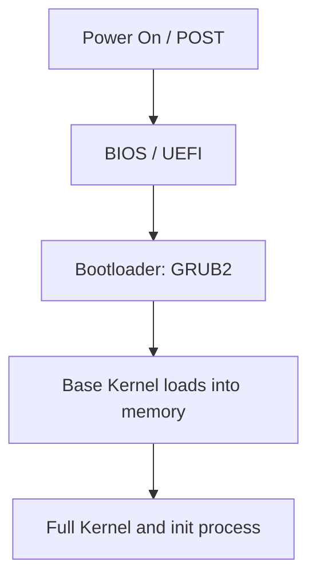

# Linux: System Configuration & Administration

## 1. Motherboard Firmware, Bootloaders & Boot Process
### Firmware
* **BIOS (Basic Input/Output System)**: Legacy motherboard firmware. Conducts Power-On Self-Test (POST), initializes hardware, and loads the bootloader from the Master Boot Record (MBR).
* **UEFI (Unified Extensible Firmware Interface)**: Modern motherboard firmware replacing BIOS. Supports larger disks, GUID Partition Tables (GPT), secure boot, and graphical interfaces.

### Bootloaders
* **GRUB / GRUB2 (Grand Unified Bootloader)**: GRUB2 is the modern rewrite of GRUB. 
  * GRUB1 configurations are defined in `menu.lst` or `grub.conf`.
  * GRUB2 configurations compile into `/boot/grub/grub.cfg` (do not edit directly).
  * System-wide GRUB defaults are customized in `/etc/default/grub`. To apply changes, run:
    ```bash
    sudo update-grub
    ```
* **PXE (Preboot Execution Environment)**: Technology allowing computers to boot using a network interface instead of local media (like USB or disks).

### The Boot Process


### Kernel Issues & Modules
* **Kernel Panics**: System crashes caused by faulty hardware (bad RAM, overheating) or software corruption (incompatible updates). Using an older, stable kernel from the GRUB boot menu can help resolve update-related panics.
* **Kernel Modules**: Drivers or features that can be dynamically loaded into the kernel:
  * View installed kernel versions/directories: `cd /lib/modules`
  * Add module at boot: List the module name in `/etc/modules`.
  * Blacklist module: Put it in a config file under `/etc/modprobe.d/blacklist.conf` (e.g., `blacklist module_name`).
  * **`insmod` vs `modprobe`**:
    * `insmod`: Legacy command. Loads a module by absolute file path; does **not** resolve dependencies.
    * `modprobe`: Modern command. Loads modules by name, automatically resolving and loading dependencies using the `/lib/modules/$(uname -r)/modules.dep` map.
    ```bash
    sudo modprobe <module_name>
    ```

---

## 2. Networking
### Network Troubleshooting Checklist
If connectivity fails:
1. Verify physical cables or wireless connection.
2. Ping local gateway IP to verify local connection.
3. Ping public DNS (e.g., `8.8.8.8`) to verify external routing.
4. Ping domain names (e.g., `google.com`) to check DNS resolution.

### Networking Tools
* `ping <ip>`: Checks network host reachability.
* `dig <domain>`: Queries DNS servers for record details (useful for diagnostics).
* `nslookup <domain>`: Simpler legacy tool to look up IP-to-domain records.
* `host <domain>`: Performs simple DNS lookups.

### Network Configuration Files
* `/etc/hosts`: Local DNS file mapping IPs to hostnames. Checked before querying public DNS.
* `/etc/nsswitch.conf`: Name Service Switch configuration. Determines the order in which DNS, hosts, and user databases are queried.
* `/etc/resolv.conf`: Contains nameserver IPs for DNS resolution. 
  > [!IMPORTANT]
  > In modern systems, this file is managed dynamically by system services (like `systemd-resolved` or `resolvconf`). Direct edits are overwritten automatically.
* `/etc/network/interfaces`: Debian/Ubuntu configuration file for network interfaces.
  * *RHEL/CentOS note*: Red Hat-based systems manage networking using individual configuration files under `/etc/sysconfig/network-scripts/`.
* **Network Bonding**: Combining multiple physical network interfaces into a single logical interface for redundancy (failover) and/or load balancing.

---

## 3. Disk Storage & Partitioning
### Linux Filesystem Paradigm
* There are no drive letters (like `C:` or `D:`) in Linux. Everything is mounted as directories under the root directory `/` (e.g., `/mnt/data`, `/home`).
* `/proc` and `/sys` are virtual filesystems residing in memory, providing kernel and process interfaces, not actual disk space.

### Partitioning Tables: MBR vs. GPT
* **MBR (Master Boot Record)**: Legacy table. Supports disks up to 2TB and a maximum of 4 primary partitions.
* **GPT (GUID Partition Table)**: Modern table. Supports disks larger than 2TB and up to 128 partitions, maintaining redundant partition table copies across the disk.

### Managing Storage
1. **Partitioning**: Creating slices on the disk.
   * Command line tools: `fdisk` (interactive), `parted` (scriptable).
   * GUI tools: `gparted`.
2. **Formatting**: Writing a filesystem to a partition.
   * Common filesystems: `ext4` (robust default), `XFS` (good for large files), `Btrfs` (supports snapshots), `VFAT`/`FAT32` (cross-compatibility).
   * Formatting command:
     ```bash
     sudo mkfs.ext4 /dev/sdb1
     ```
3. **Mounting**: Attaching a formatted partition to a directory.
   ```bash
   sudo mount /dev/sdb1 /mnt/mydata
   sudo umount /mnt/mydata
   ```
   * **Persistent Mounts**: To preserve mounts after rebooting, add entries to `/etc/fstab`:
     ```text
     # <device>   <mountpoint>   <filesystem>   <options>   <dump>   <pass>
     /dev/sdb1    /mnt/mydata    ext4           defaults    0        2
     ```

---

## 4. Advanced Storage: LVM & RAID
### LVM (Logical Volume Manager)
LVM acts as an abstraction layer between physical storage and the operating system, allowing you to pool physical disks and dynamically resize partitions.
* **LVM Architecture**:
  ```text
  Physical Disks (/dev/sda, /dev/sdb)
        ↓
  Physical Volumes (PV)
        ↓ (Grouped together)
  Volume Group (VG - Storage pool)
        ↓ (Sliced into)
  Logical Volumes (LV - Formatted & Mounted)
  ```
* **Resizing**: You can easily grow or shrink Logical Volumes dynamically as needed.

### RAID (Redundant Array of Independent Disks)
Combines multiple physical hard drives into a single logical drive for performance, redundancy, or both:
* **RAID 0**: Striping. Fast performance, no redundancy.
* **RAID 1**: Mirroring. Identical copy of data on two disks.
* **RAID 5 / 6**: Striping with parity. Tolerates disk failures.
* **Integration**: Physical Drives → RAID (for hardware reliability) → LVM on top (for resizing flexibility).

---

## 5. Software Installation
* **Tarball (`.tar.gz`)**: Compressed archive files containing source code or pre-compiled binaries.
* **Debian Package (`.deb`)**: Installation package for Debian/Ubuntu.
  * Install locally: `sudo dpkg -i file.deb`
  * Manage dependencies automatically: `sudo apt install` or `aptitude`.
* **Red Hat Package (`.rpm`)**: Package for RHEL/CentOS/Fedora, installed using `yum` or `dnf`.
* **Repositories**: Custom package source addresses are added in `/etc/apt/sources.list` or configured in `/etc/apt/sources.list.d/`.

---

## 6. User and Group Management
### Commands
* `useradd -d /home/username -s /bin/bash username`: Creates a user with home directory (`-d`) and default shell (`-s`).
* `passwd username`: Sets or changes a user's password.
* `userdel -r username`: Deletes a user and removes their home directory (`-r`).
* `adduser username`: Debian/Ubuntu interactive script that manages directory creation and defaults automatically (recommended over `useradd`).
* `groupadd <group_name>` / `groupdel <group_name>`: Creates or deletes a user group.
* `groups <username>`: Displays the groups a user belongs to.
* `usermod -a -G <group_name> <username>`: Appends (`-a`) the user to a secondary group (`-G`).
* `whoami`: Prints the active username.
* `who`: Lists all users currently logged into the system.

### User Configuration & Quotas
* **Disk Quotas**: System administrators can enforce storage quotas (soft and hard limits) on block usage or the total number of files a user can create.
* **`.bashrc`**: A shell script executed automatically every time a user logs into a bash shell, setting up aliases, paths, and environments.

---

## 7. Command Redirection & Text Processing
### Input/Output Redirection
* `>`: Redirects standard output (stdout), overwriting the file.
  ```bash
  ls > results.txt
  ```
* `>>`: Appends standard output to a file.
* `2>`: Redirects standard error (stderr).
  ```bash
  ls non_existent_folder 2> error.txt
  ```
* `/dev/null`: The "black hole" device. Output sent here is discarded.
  ```bash
  command > /dev/null 2>&1  # Suppresses all stdout and stderr
  ```
* `|` (Pipe): Passes the output of one command as input to another.
* `tee`: Directs output to both stdout and a file.
  ```bash
  cat file.txt | tee copy.txt
  ```
* `xargs`: Converts standard input into arguments for other commands.
  ```bash
  # If file.txt has folders listed, creates directories for each:
  cat file.txt | xargs mkdir
  ```

### Text Processing & Search
* `grep -F "string" file`: Searches for a fixed string in a file.
* `sort <file>`: Sorts lines of text.
* `wc <file>`: Returns word, line, and character counts.
* `cut -c 3,4,5 file.txt`: Extracts columns or characters (e.g., 3rd, 4th, and 5th characters of each line).
* `sed`: Stream editor used for filtering and transforming text.

### Links
* **Soft Link (Symbolic Link)**: A pointer referencing the target file's path. If the original file is deleted, the link breaks (dangling link). Created with `ln -s`.
* **Hard Link**: A direct reference to the target file's inode on disk. It acts as an identical mirror. If the original file is deleted, the data remains accessible through the hard link.

### File Copying & Indexing
* `locate <filename>`: Searches database index for files instantly.
  * Update database cache: `sudo updatedb`
* `scp user@host:/path/file .`: Copies files securely over SSH.
* `rsync -av <source> <dest>`: Synchronizes files recursively and efficiently, preserving timestamps/permissions (`-a`) with verbose output (`-v`).

---

## 8. Services and Initialization
### Init Systems
* **SystemV (SysV)**: Legacy initialization system. Services are stored as scripts in `/etc/init.d/` and managed using `service`. Works with **Runlevels (0-6)**:
  * `0`: Halt
  * `1`: Single-user mode
  * `3`: Multi-user text mode
  * `5`: Graphical mode
  * `6`: Reboot
* **systemd**: Modern init system replacing SysV. Uses **targets** instead of runlevels (e.g., `graphical.target`, `multi-user.target`) and unit files to manage services.
  ```bash
  systemctl status <service>
  systemctl start <service>
  systemctl enable <service> # starts service automatically on boot
  ```
* `chkconfig --list <service>`: Legacy tool to check service runlevels.

---

## 9. Server Management & Security
* **SSL Certificates**: Verify identities and encrypt traffic. Avoid accepting self-signed certificates in production, though they are fine for local testing.
* **Directory Services**: Used to manage users and permissions globally. Active Directory (AD) is commonly used, with OpenLDAP/NIS as alternative open-source tools.
* **Monitoring**: **Syslog** (centralized system event logs) and **SNMP** (Simple Network Management Protocol, used to query statistics from network devices).
* **VPN (Virtual Private Network)**: Creates an encrypted tunnel to access private network services securely.
* **Cluster vs. Load Balancer**:
  * **Cluster**: Group of interconnected servers working together as a single system. Servers are state-aware and coordinate tasks.
  * **Load Balancer**: A device or service that routes traffic across a pool of servers without managing server state directly.

---

## 10. Jobs & Automation
### Cron Jobs
Runs tasks on a recurring schedule. Defined by 5 fields:
`Minute Hour Day_of_Month Month Day_of_Week`
* System cron config folder: `/etc/cron.d/`

### Job Control
* `&`: Run a command in the background (e.g., `sleep 100 &`).
* `jobs`: Lists active background jobs and job numbers.
* `fg %<job_number>`: Brings a background job to the foreground.
* `nohup <command>`: Runs a command immune to hangups, allowing the job to continue even if the user logs out.

---

## 11. Hardware Devices
* `dmesg`: Displays kernel ring buffer messages (shows plugged-in/attached hardware).
* `lsblk`: Lists block storage devices.
* `lscpu`: Displays detailed CPU information.
* `lsdev`: Displays hardware devices and the system resource parameters they use.
* `lspci`: Lists PCI devices (devices connected to the PCI bus, like graphics/network cards).
* `lsmem`: Lists system memory block details.
* **`/proc` vs `/sys` History**: Virtual folders. Historically, `/proc` was crowded with all process, CPU, hardware, and kernel configuration files. The `/sys` filesystem was created to clean this up, housing structured device and driver details. Legacy configurations remain in `/proc`, while newer ones map to `/sys`.
* **CUPS**: Common UNIX Printing System, used to manage network and local printers via command line (`lpr`, `lpq`) or a web interface.
* **udev**: Device manager that runs rules dynamically when devices are plugged or unplugged.

---

## Summary
This note covers:
* System firmware (BIOS vs. UEFI) and bootloader configs (GRUB2, update-grub).
* Kernel modules management (`modprobe` vs `insmod`) and blacklisting.
* Network configuration, DNS settings files, and bonding.
* Disk partitioning (MBR vs. GPT), formatting (`mkfs`), and persistent mounting (`/etc/fstab`).
* LVM logical layout abstractions and RAID setups.
* Linux packages (`.deb`, `.rpm`) and repository configuration.
* User/Group creation and filesystem quotas.
* Redirection utilities, piping, stream filtering (`grep`, `sed`), and linking (soft vs. hard links).
* Init architectures (SysV runlevels vs. `systemd` targets) and service management (`systemctl`).
* Server security (SSL, LDAP/Active Directory), SNMP monitoring, VPNs, and load balancing.
* Task scheduling (Cron) and shell job control (`&`, `fg`, `nohup`).
* Hardware diagnostics commands and the virtual `/proc` and `/sys` file layouts.
